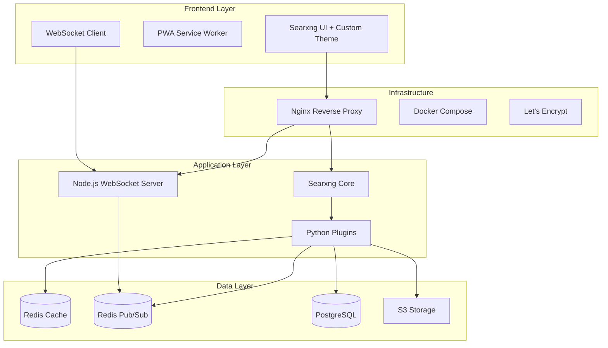

# 🏗️ Searxng Convivial Instance: Master Task Management System

## 🧠 Integration Architecture Overview

### Core Components & Dependencies


---

## 📋 Comprehensive Task Breakdown

### Phase 0: Planning & Setup (Week 0)
| Task ID | Task | Priority | Est. Hours | Dependencies | Skills |
|---------|------|----------|------------|--------------|--------|
| P0.1 | Finalize technical architecture | 🔴 Critical | 4h | None | Architecture |
| P0.2 | Choose VPS provider & size | 🔴 Critical | 2h | P0.1 | DevOps |
| P0.3 | Set up development environment | 🔴 Critical | 4h | None | Full-stack |
| P0.4 | Create GitHub repository structure | 🟡 High | 2h | None | Git |
| P0.5 | Design database schemas | 🔴 Critical | 6h | P0.1 | Database |

### Phase 1: Infrastructure Foundation (Week 1)
| Task ID | Task | Priority | Est. Hours | Dependencies | Skills |
|---------|------|----------|------------|--------------|--------|
| I1.1 | Provision VPS (4-8GB RAM) | 🔴 Critical | 2h | P0.2 | DevOps |
| I1.2 | Install Docker & Docker Compose | 🔴 Critical | 2h | I1.1 | DevOps |
| I1.3 | Configure firewall rules | 🔴 Critical | 2h | I1.1 | Security |
| I1.4 | Set up Nginx reverse proxy | 🔴 Critical | 4h | I1.2 | DevOps |
| I1.5 | Configure Let's Encrypt SSL | 🔴 Critical | 3h | I1.4 | DevOps |
| I1.6 | Deploy Redis (dual instance) | 🔴 Critical | 4h | I1.2 | Database |
| I1.7 | Deploy PostgreSQL with schemas | 🔴 Critical | 4h | I1.2, P0.5 | Database |
| I1.8 | Configure automated backups | 🟡 High | 4h | I1.6, I1.7 | DevOps |
| I1.9 | Set up monitoring (Prometheus) | 🟡 High | 6h | I1.2 | DevOps |
| I1.10 | Create Docker Compose orchestration | 🔴 Critical | 6h | All above | DevOps |

### Phase 2: Searxng Core Setup (Week 1-2)
| Task ID | Task | Priority | Est. Hours | Dependencies | Skills |
|---------|------|----------|------------|--------------|--------|
| S2.1 | Deploy base Searxng instance | 🔴 Critical | 4h | I1.10 | Backend |
| S2.2 | Configure academic engines | 🔴 Critical | 8h | S2.1 | Config |
| S2.3 | Configure French archives | 🔴 Critical | 12h | S2.1 | Config/Scraping |
| S2.4 | Configure music engines | 🔴 Critical | 8h | S2.1 | Config |
| S2.5 | Create engine health monitor | 🟡 High | 6h | S2.2-S2.4 | Python |
| S2.6 | Implement search weights | 🟡 High | 4h | S2.2-S2.4 | Python |
| S2.7 | Configure result caching | 🟡 High | 4h | I1.6, S2.1 | Backend |
| S2.8 | Test all engines thoroughly | 🔴 Critical | 8h | S2.2-S2.7 | QA |

### Phase 3: Plugin Development (Week 2-3)
| Task ID | Task | Priority | Est. Hours | Dependencies | Skills |
|---------|------|----------|------------|--------------|--------|
| **Core Plugins** |
| P3.1 | convivial_presence.py | 🔴 Critical | 16h | S2.1, I1.6 | Python |
| P3.2 | discovery_feed.py | 🔴 Critical | 16h | S2.1, I1.7 | Python |
| P3.3 | search_moods.py | 🟡 High | 12h | S2.1 | Python |
| P3.4 | Plugin error handling | 🔴 Critical | 8h | P3.1-P3.3 | Python |
| P3.5 | Plugin performance optimization | 🟡 High | 8h | P3.1-P3.3 | Python |
| **Advanced Plugins** |
| P3.6 | voice_notes.py | 🟢 Medium | 20h | S2.1, S3 storage | Python/Audio |
| P3.7 | time_capsule.py | 🟢 Medium | 12h | P3.2 | Python |
| P3.8 | collision_detector.py | 🟢 Medium | 12h | P3.1, P3.2 | Python |
| P3.9 | gift_wrapper.py | 🟢 Medium | 8h | P3.2 | Python |

### Phase 4: Real-time Infrastructure (Week 3)
| Task ID | Task | Priority | Est. Hours | Dependencies | Skills |
|---------|------|----------|------------|--------------|--------|
| R4.1 | Node.js WebSocket server setup | 🔴 Critical | 8h | I1.10 | Node.js |
| R4.2 | Socket.io + Redis adapter | 🔴 Critical | 6h | R4.1, I1.6 | Node.js |
| R4.3 | Room management system | 🔴 Critical | 8h | R4.2 | Node.js |
| R4.4 | Presence tracking logic | 🔴 Critical | 12h | R4.3, P3.1 | Node.js |
| R4.5 | Connection state recovery | 🟡 High | 8h | R4.2 | Node.js |
| R4.6 | WebSocket clustering | 🟢 Medium | 8h | R4.2 | DevOps |
| R4.7 | Real-time event handlers | 🔴 Critical | 12h | R4.3 | Node.js |
| R4.8 | Client-side WebSocket integration | 🔴 Critical | 12h | R4.1 | Frontend |

### Phase 5: UI/UX Implementation (Week 3-4)
| Task ID | Task | Priority | Est. Hours | Dependencies | Skills |
|---------|------|----------|------------|--------------|--------|
| **Base Modifications** |
| U5.1 | Modify Searxng base templates | 🔴 Critical | 12h | S2.1 | Frontend |
| U5.2 | Add presence UI components | 🔴 Critical | 16h | U5.1, R4.8 | Frontend |
| U5.3 | Discovery feed sidebar | 🔴 Critical | 16h | U5.1, P3.2 | Frontend |
| U5.4 | Search mood selector | 🟡 High | 8h | U5.1, P3.3 | Frontend |
| **Theme System** |
| U5.5 | CSS variable architecture | 🟡 High | 8h | U5.1 | CSS |
| U5.6 | Seasonal theme assets | 🟢 Medium | 12h | U5.5 | Design |
| U5.7 | Living theme animations | 🟢 Medium | 16h | U5.5 | CSS/JS |
| U5.8 | Mobile responsive design | 🔴 Critical | 12h | U5.1-U5.4 | Frontend |
| U5.9 | PWA implementation | 🟡 High | 8h | U5.8 | Frontend |

### Phase 6: Collaboration Features (Week 4-5)
| Task ID | Task | Priority | Est. Hours | Dependencies | Skills |
|---------|------|----------|------------|--------------|--------|
| **Morning Coffee** |
| C6.1 | Discovery aggregation system | 🟡 High | 8h | P3.2 | Backend |
| C6.2 | Digest generation (GPT API) | 🟢 Medium | 8h | C6.1 | Backend |
| C6.3 | Morning coffee UI | 🟡 High | 8h | U5.1, C6.1 | Frontend |
| **Gift Discoveries** |
| C6.4 | Gift queue system | 🟡 High | 8h | P3.9, I1.6 | Backend |
| C6.5 | Surprise timing algorithm | 🟢 Medium | 6h | C6.4 | Backend |
| C6.6 | Gift unwrap animations | 🟢 Medium | 8h | C6.4 | Frontend |
| **Voice Notes** |
| C6.7 | WebRTC recording | 🟢 Medium | 12h | P3.6 | Frontend |
| C6.8 | Audio compression pipeline | 🟢 Medium | 8h | C6.7 | Backend |
| C6.9 | S3 storage integration | 🟢 Medium | 6h | C6.8 | Backend |
| C6.10 | Transcription service | 🟢 Medium | 8h | C6.8 | Backend |
| **PDF Collaboration** |
| C6.11 | PDF.js integration | 🟢 Medium | 8h | U5.1 | Frontend |
| C6.12 | Annotation sync system | 🟢 Medium | 12h | R4.7, C6.11 | Full-stack |
| C6.13 | Emoji trail system | 🟢 Low | 6h | U5.1 | Frontend |

### Phase 7: Security & Privacy (Week 5)
| Task ID | Task | Priority | Est. Hours | Dependencies | Skills |
|---------|------|----------|------------|--------------|--------|
| X7.1 | Ghost mode implementation | 🔴 Critical | 8h | P3.1 | Backend |
| X7.2 | Keyword privacy detection | 🔴 Critical | 6h | X7.1 | Backend |
| X7.3 | Shared secret URL auth | 🔴 Critical | 4h | S2.1 | Backend |
| X7.4 | OAuth integration (optional) | 🟢 Medium | 12h | X7.3 | Backend |
| X7.5 | Rate limiting per user | 🟡 High | 4h | I1.6 | Backend |
| X7.6 | Input sanitization | 🔴 Critical | 6h | All inputs | Security |
| X7.7 | CORS configuration | 🔴 Critical | 2h | R4.1 | Security |
| X7.8 | Security audit | 🔴 Critical | 8h | All above | Security |

### Phase 8: Testing & QA (Week 5-6)
| Task ID | Task | Priority | Est. Hours | Dependencies | Skills |
|---------|------|----------|------------|--------------|--------|
| T8.1 | Unit tests (Python plugins) | 🔴 Critical | 16h | P3.* | Testing |
| T8.2 | Unit tests (Node.js) | 🔴 Critical | 12h | R4.* | Testing |
| T8.3 | Integration tests | 🔴 Critical | 16h | All | Testing |
| T8.4 | E2E tests (Playwright) | 🔴 Critical | 20h | All UI | Testing |
| T8.5 | Load testing | 🟡 High | 8h | All | Testing |
| T8.6 | Performance benchmarks | 🟡 High | 8h | All | Testing |
| T8.7 | Manual testing checklist | 🔴 Critical | 12h | All | QA |
| T8.8 | Bug fixes & refinements | 🔴 Critical | 24h | T8.1-T8.7 | All |

### Phase 9: Deployment & DevOps (Week 6)
| Task ID | Task | Priority | Est. Hours | Dependencies | Skills |
|---------|------|----------|------------|--------------|--------|
| D9.1 | CI/CD pipeline (GitHub Actions) | 🟡 High | 8h | All code | DevOps |
| D9.2 | Ansible deployment playbooks | 🟡 High | 12h | I1.* | DevOps |
| D9.3 | Monitoring dashboards | 🟡 High | 8h | I1.9 | DevOps |
| D9.4 | Log aggregation setup | 🟢 Medium | 6h | I1.10 | DevOps |
| D9.5 | Backup automation | 🔴 Critical | 6h | I1.8 | DevOps |
| D9.6 | Cost tracking system | 🟢 Medium | 4h | All | DevOps |
| D9.7 | Documentation | 🟡 High | 16h | All | Technical writing |
| D9.8 | Launch preparation | 🔴 Critical | 8h | All | Project mgmt |

---

## 🎯 Critical Path Analysis

### MVP Path (3 weeks)
```
Week 1: Infrastructure → Basic Searxng → Core engines
Week 2: Presence plugin → Discovery feed → WebSocket server
Week 3: Basic UI → Real-time integration → Testing
```

### Full Implementation (6 weeks)
```
Week 1: Complete infrastructure
Week 2: All engines + core plugins
Week 3: Real-time + UI themes
Week 4: Collaboration features
Week 5: Security + testing
Week 6: Deployment + launch
```

---

## 📊 Resource Allocation

### Team Roles (for 2-3 friends)
1. **Backend Lead**: Searxng, plugins, databases
2. **Frontend Lead**: UI, themes, real-time client
3. **DevOps Lead**: Infrastructure, deployment, monitoring

### Time Estimates
- **Total Hours**: ~800 hours
- **Per Person** (3 people): ~267 hours
- **Duration**: 6 weeks at 40h/week each

---

## 🚧 Risk Management

### High-Risk Areas
1. **Engine Reliability**: Some archives may change structure
   - Mitigation: Robust error handling, auto-disable failing engines
   
2. **WebSocket Scaling**: Real-time with multiple users
   - Mitigation: Redis adapter, clustering ready
   
3. **Voice Storage Costs**: S3 can get expensive
   - Mitigation: Compression, retention policies
   
4. **Privacy Breaches**: Friend data exposure
   - Mitigation: Security audit, encryption, ghost mode

---

## 📈 Success Metrics

### Technical KPIs
- Search response time < 2s
- WebSocket latency < 100ms
- 99.9% uptime
- Zero security incidents

### Convivial KPIs
- Daily active usage by all friends
- 10+ discoveries shared per week
- 5+ collision moments per month
- Morning coffee engagement > 80%

---

## 🔄 Iteration Plan

### Post-Launch Enhancements
1. **Month 1**: Refine based on usage patterns
2. **Month 2**: Add requested engines/features
3. **Month 3**: Performance optimization
4. **Month 4**: Federation experiments
5. **Month 5**: AI enhancements
6. **Month 6**: Mobile app consideration

---

## 🛠️ Technical Integration Details

### Socket.io Real-time Architecture
Based on Context7 analysis, the Socket.io implementation will use:
- **Rooms**: One per friend group for isolation
- **Redis Adapter**: For multi-instance synchronization
- **Connection State Recovery**: For seamless reconnections
- **Promise-based Acknowledgements**: For reliable message delivery

### Redis Dual-Instance Strategy
1. **Cache Instance** (Port 6379)
   - Search result caching
   - Engine health status
   - User preferences
   
2. **Pub/Sub Instance** (Port 6380)
   - Real-time presence broadcasting
   - Discovery feed updates
   - WebSocket message routing

### PostgreSQL Schema Design
```sql
-- Core tables with JSONB for flexibility
CREATE TABLE users (
    id UUID PRIMARY KEY,
    username VARCHAR(50) UNIQUE,
    current_mood VARCHAR(50),
    current_fascination TEXT,
    avatar_url TEXT,
    created_at TIMESTAMP DEFAULT NOW()
);

CREATE TABLE discoveries (
    id UUID PRIMARY KEY,
    user_id UUID REFERENCES users(id),
    query TEXT,
    result_url TEXT,
    result_data JSONB,
    annotations JSONB,
    gifted_to UUID REFERENCES users(id),
    discovered_at TIMESTAMP DEFAULT NOW()
);

CREATE TABLE collections (
    id UUID PRIMARY KEY,
    name VARCHAR(100),
    type VARCHAR(50),
    owner_id UUID REFERENCES users(id),
    metadata JSONB,
    growth_data JSONB,
    season VARCHAR(20)
);
```

### Plugin Error Handling Pattern
```python
class ConvivialPlugin:
    def __init__(self):
        self.redis_cache = Redis(port=6379)
        self.redis_pubsub = Redis(port=6380)
        
    def on_search(self, query, user):
        try:
            # Non-blocking execution
            asyncio.create_task(self._process_search(query, user))
        except Exception as e:
            logger.error(f"Plugin error: {e}")
            # Never block main search flow
            
    async def _process_search(self, query, user):
        # Actual processing here
        pass
```

---

This comprehensive task management system provides a clear roadmap from conception to launch, with all dependencies mapped and critical paths identified. The modular approach allows for MVP delivery in 3 weeks while building toward the full vision over 6 weeks.